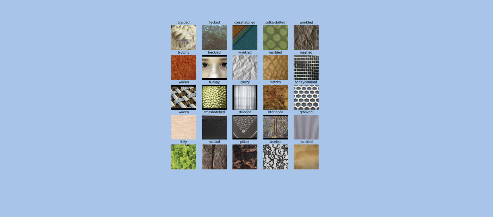
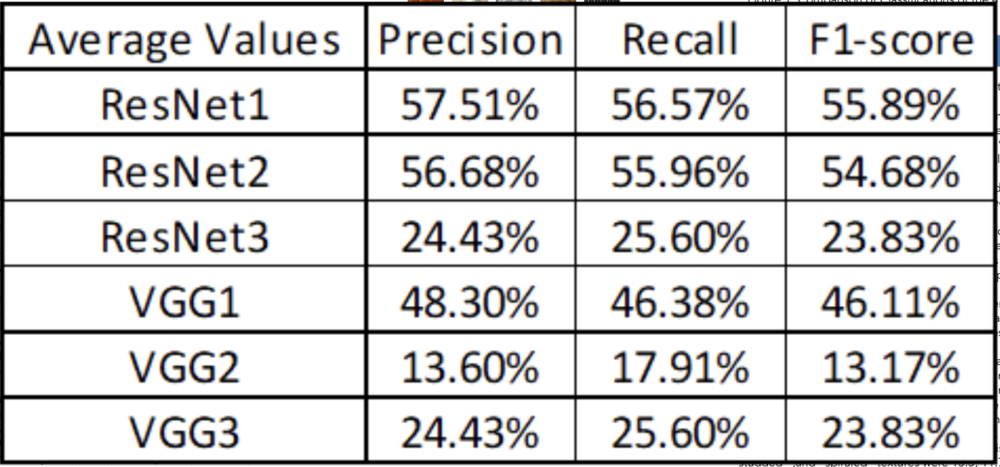

# Texture Classifier

Alongside two students, I built two base deep learning models for my Spring 2022 Deep Learning course to classify images based on texture and then fine-tuned the models to investigate how modifications to the architecture, tunable parameters, and amount of data passed in affected the learning and texture classification capabilities of the models.

    

## Table of Contents
* [Technologies Used](#technologies-used)
* [General Info](#general-info)
* [Features](#features)
* [Results](#results)
* [Project Status](#project-status)
* [Contributions](#contributions)
<!-- * [License](#license) -->

## Technologies Used
Python, TensorFlow
 
## General Info

We used the standard dataset DTD (Describable Textures Dataset), consisting of 56400 images, organized according to a list of 47 terms (categories) inspired from human perception. We reshaped and normalized the images, then split them into three groups: training, testing, and validation. We built two base models using ResNet and VGG and then modified them to optimize texture classification. In the end, we compared the performance of 3 ResNet models and 3 VGG models.

## Features

### ResNet Models:

The first base model was a ResNet that extracts 1000 features from the images, then passes the output into a fully connected dense layer with some pooling and dropouts. The second model had the same architecture as the first, but we decreased the batch size, and imputed four times as much data for the training, testing, and validation. The third ResNet model was identical to the first, but included two convolution layers.

### VGG Models:

We used VGG16 as a base model for all 3 of our VGG models. For our first VGG model, we only added 2D global average pooling and a single softmax-activated dense linear layer. For our second VGG model, we added two relu-activated 2D convolution layers, followed by 2D global average pooling. Then, after a flatten layer, we passed the outputs through 3 dense blocks. The dense block architecture consisted of a relu-activated dense layer followed by batch normalization and a dropout layer. The output was then passed through a final dense layer, activated with softmax. For our third VGG model, we used a convolution block consisting of two separable convolution layers with 32 output filters, followed by batch normalization and 2D Global Average Pooling. The output was then passed through 3 dense blocks and a final dense layer.

## Results

In order to evaluate the effectiveness of the models, we examined both precision and recall and used them to calculate F1-score (the harmonic mean of the two values). The first ResNet model performed the best and achieved the highest F1-score out of all the models. The second VGG model performed the worst out of all the models. This is consistent with the low accuracy and high loss observed for this model during the training and testing process. The first VGG model was the most successful VGG model, which is also consistent with its relatively high accuracy and low loss.

    
     
    above: shows the average accuracy values for the models.

 

    
     
    above: comparing classifications of the 47 Textures by all models.

## Project Status
Project is: Complete (as of May 2022)

## Contributions

I specifically worked on the 3 VGG models.

My group members: Dhiraj Khanal, Rakan Mosa O Alomran

Here is the link to the [Project Writeup](https://docs.google.com/document/d/1nTk9OHvCTI8rGrsVXXEZt9qAQBM3ojPsbBitPrDigeY/edit?usp=sharing).

A poster summarizing the project:

